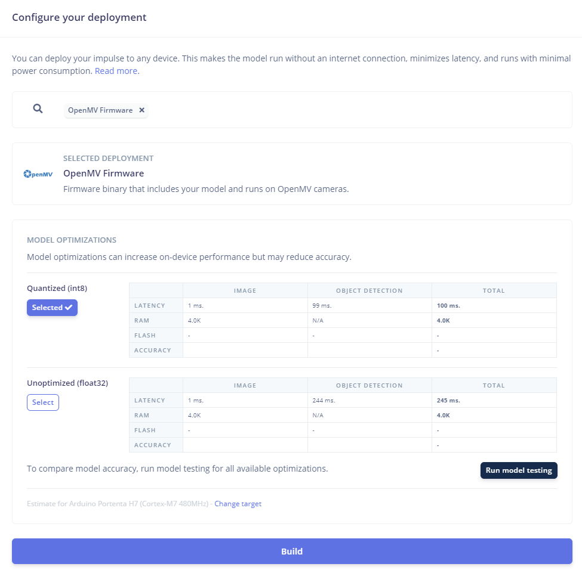

# Rooftop ice buildup detection using Edge Impulse with synthetic data created with NVIDIA Omniverse Replicator

## Intro
This portable device monitors buildings and warns when potential hazardous icicles are formed. In ideal conditions icicles can form at a rate of [more than 1 cm (0.39 in) per minute](https://en.wikipedia.org/wiki/Icicle). As numerous people are injured and killed by these solid projectiles each year, responsible building owners often close sidewalks in the spring to minimize risk. This project demonstrates how an extra set of digital eyes can notify property owners icicles are forming and need to be removed before they can cause harm.

## Hardware used:
* [Arduino Portena H7](https://docs.arduino.cc/hardware/portenta-h7/)
* [Arduino Portena Vision Shield w/LoRa Connectivity](https://docs.arduino.cc/hardware/portenta-vision-shield/)
* NVIDIA GeForce RTX
* Formlabs Form 2 3D printer

## Software used:
* [Edge Impulse Studio](https://studio.edgeimpulse.com/studio)
* [NVIDIA Omniverse Code](https://www.nvidia.com/en-us/omniverse/) with [Replicator](https://developer.nvidia.com/omniverse/replicator)
* [Visual Studio Code](https://code.visualstudio.com/)
* [Blender](https://www.blender.org/)
* [Autodesk Fusion 360](https://www.autodesk.no/products/fusion-360/)

## Code and machine learning repository
Project [Impulse](https://studio.edgeimpulse.com/public/332581/latest) and [code repository](https://github.com/eivholt/icicle-monitor).

## Working principle
Forming icicles are detected using a neural network with an architecture aimed at detecting objects in images from the on-board camera. The NN is trained and tested exclusively on synthesized images. The images are generated with realistic simulated lighting conditions. A small amount of real images are used to verify the model.

## Challenges
The main challenge of detecting forming icicles is the transparent nature of ice. Because of this we need a great number of images to train a model that captures enough features of the ice with varying lighting conditions. We can mitigate this problem by synthesizing a lot of images, but we need to be able to vary lighting conditions in a realistic manner.

## Mobility
A powerful platform combined with a high resolution camera with fish-eye lense would increase the ability to detect icicles. However, by implementing the object detection model on a small, power-efficient, but highly constrained device, options for deployment increase. Properly protected against moisture this device can be mounted outdoors on poles facing roofs in question. LoRaWAN communication enables low battery consumption and long transmission range.

## Limitations
### Weatherproofing
The device enclosure is not properly sealed for permanent outdoor installation. The camera is mounted on the shield PCB and will need some engineering to be able to see through the enclosure while remaining water tight. For inspiration on how to create weather-proof enclosures that allow sensors and antennas outside access, [see this project](https://www.hackster.io/eivholt/low-power-snow-depth-sensor-using-lora-e5-b8e7b8) on friction fitting and use of rubber washers. The project in question also proves that battery operated sensors can work with no noticible degradation in winter conditions (to at least -15 degrees Celcius).

### Obscured view
The project has no safe-guard against false negatives. The device will not report if it's view is blocked. This could be resolved by placing static markers on both sides of an area to monitor and included in synthetic training data. Absence of at least one marker could trigger a notification that the view is obscured.

### Object scale
Due to optimization techniques in Faster Objects - More Objects (FoMo) determining relative sizes of the icicles is not feasible. As even icicles with small mass can be harmful at moderate elevation this is not a crucial feature.

### Exact number of icicles
The object detection model has not been trained to give an exact number of icicles in view. This has no practical implication other than the model verification results appearing worse than practical performance.

### Grayscale
To be able to compile a representation of our neural network and have it run on the severely limited amount of RAM available on the Arduino Portena H7, pixel representation has been limited to a single channel - grayscale. Colors are not needed to detect icicles so this will not affect the results.

## Object detection using neural networks
[FOMO (Faster Objects, More Objects)](https://docs.edgeimpulse.com/docs/edge-impulse-studio/learning-blocks/object-detection/fomo-object-detection-for-constrained-devices) is a novel machine learning algorithm that allows for visual object detection on highly constrained devices through training of a neural network with a number of convolutional layers.


### Capturing training data and labeling objects
One of the most labor intensive aspects of building any machine learning model is gathering the training data and to label it. For an object detection model this requires taking hundreds or thousands of images of the objects to detect, drawing rectangles around them and choosing the correct label for each class. Recently generating pre-labeled images has become feasible and has proven great results. This is referred to as synthetic data generation with domain randomization. In this project a model will be trained exclusively on synthetic data and we will see how it can detect the real life counterparts.

### Domain randomization using NVIDIA Omniverse Replicator
NVIDIA Omniverse Code is an IDE that allows us to compose 3D scenes and to write simple Python code to capture images. Further, the extention Replicator is a toolkit that allows us to label the objects in the images and to simplify common domain randomization tasks, such as scattering objects between images. For an in-depth walkthrough on getting started with Omniverse and Replicator [see this article](https://docs.edgeimpulse.com/experts/featured-machine-learning-projects/surgery-inventory-synthetic-data).

### Making a scene
It's possible to create an empty scene in Omniverse and add content programmatically. However, composing initial objects by hand serves as a practical starting point. In this project a royalty free 3D model of a house was used as a basis.

### Icicles

### Randomizing colors
The surface behind the icicles may vary greatly, both in color and texture. Using Replicator randomizing the color of an objects material is easy.

In the scene in Omniverse either manually create a plane behind the icicles, or create one programmatically.

In code, define a function that takes in a reference to the plane we want to randomize the color of and use one of the distribution functions with min and max value span:

```python
def randomize_screen(screen):
		with screen:
			# Randomize each RGB channel for the whole color spectrum.
            rep.randomizer.color(colors=rep.distribution.uniform((0, 0, 0), (1, 1, 1)))
		return screen.node
```

Then get a reference to the plane:

```python
screen = rep.get.prims(path_pattern='/World/Screen')
```

Lastly register the function and trigger it on each new frame:

```python
rep.randomizer.register(randomize_screen)
with rep.trigger.on_frame(num_frames=2000, rt_subframes=50):  # rt_subframes=50
        # Other randomization functions...
		rep.randomizer.randomize_screen(screen)
```

Now each image will have a background with random (deterministic, same starting seed) RGB color. Replicator takes care of creating a material with a shader for us. As you might remember, in an effort to reduce RAM usage our neural network reduces RGB color channels to grayscale. In this project we could simplify the color randomization to only pick grayscale colors. The example has been included as it would benefit in projects where color information is not reduced. To only randomize in grayscale, we could change the code in the randomization function to use the same value for R, G and B as follows:

```python
def randomize_screen(screen):
		with screen:
			# Generate a single random value for grayscale
			gray_value = rep.distribution.uniform(0, 1)
			# Apply this value across all RGB channels to ensure the color is grayscale
			rep.randomizer.color(colors=gray_value)
		return screen.node
```

### Randomizing textures
To further steer training of the object detection model in capturing features of the desired class, the icicles, and not features that appear due to short commings in the domain randomization, we can create images with the icicles in front of a large variety of background images. A simple way of achieving this is to use a large dataset of random images and randomly assigning one of them to a background plane for each image generated.


```python
import os

def randomize_screen(screen, texture_files):
		with screen:
			# Let Replicator pick a random texture from list of .jpg-files
			rep.randomizer.texture(textures=texture_files)
		return screen.node

# Define what folder to look for .jpg files in
folder_path = 'C:/Users/eivho/source/repos/icicle-monitor/val2017/testing/'
# Create a list of strings with complete path and .jpg file names
texture_files = [os.path.join(folder_path, f) for f in os.listdir(folder_path) if f.endswith('.jpg')]

# Register randomizer
rep.randomizer.register(randomize_screen)

# For each frame, call randomization function
with rep.trigger.on_frame(num_frames=2000, rt_subframes=50):
    # Other randomization functions...
    rep.randomizer.randomize_screen(screen, texture_files)
```

We could instead generate textures with random shapes and colors. Either way, the resulting renders will look weird, but help the model training process weight features that are relevant for the icicles, not the background.

These are rather unsofisticated approaches. More realistic results would be achieved by changing the [materials](https://docs.omniverse.nvidia.com/materials-and-rendering/latest/materials.html) of the actual walls of the house used as background. Omniverse has a large selection of available materials available in the NVIDIA Assets browser, allowing us to randomize a [much wider range of aspects](https://docs.omniverse.nvidia.com/extensions/latest/ext_replicator/randomizer_details.html) of the rendered results.

## Deployment to device and LoRaWAN
### Testing model on device using OpenMV
To get visual verification our model works as intended we can go to Deployment in Edge Impulse Studio, select **OpenMV Firmware** as target and build. 



Follow the [documentation](https://docs.edgeimpulse.com/docs/run-inference/running-your-impulse-openmv) on how to flash the device and to modify the ei_object_detection.py code. Remember to change: sensor.set_pixformat(sensor.GRAYSCALE)! The file edge_impulse_firmware_arduino_portenta.bin is our firmware for the Arduino Portenta H7 with Vision shield.


### Deploy model as Arduino compatible library and send inference results to The Things Network with LoRaWAN
Start by selecting Arduino library as Deployment target.


Once built and downloaded, open Arduino IDE, go to **Sketch> Include Library> Add .zip Library ...** and locate the downloaded library. Next go to **File> Examples> [name of project]_inferencing> portenta_h7> portenat_h7_camera** to open a generic sketch template using our model. To test the model continuously and print the results to console this sketch is ready to go. The code might appear daunting, but we really only need to focus on the loop() function.


### Transmit results to The Things Stack sandbox using LoRaWAN
Using The Things Stack sandbox (formely known as The Things Network) we can create a low-power sensor network that allows transmitting device data with minimal energy consumption, long range without network fees. Your area might already be covered by a crowd funded network, or you can [initiate your own](https://www.thethingsnetwork.org/community/bodo/). [Getting started with LoRaWAN](https://www.thethingsindustries.com/docs/getting-started/) is really fun!


Following the [Arduino guide](https://docs.arduino.cc/tutorials/portenta-vision-shield/connecting-to-ttn/) we create an application in The Things Stack sandbox and register our first device.


Next we will simplify things by merging an example Arduino sketch for transmitting a LoRaWAN-message with the Edge Impulse generated object detection model code. Open the example sketch called LoraSendAndReceive included with the MKRWAN(v2) library mentioned in the [Arduino guide](https://docs.arduino.cc/tutorials/portenta-vision-shield/connecting-to-ttn/). In the [project code repository](https://github.com/eivholt/icicle-monitor/tree/main/portenta-h7/portenta_h7_camera_lora) we can find an Arduino sketch witht the merged code.


In short we perform inference evary 10 seconds. If any icicles are detected we simply transmit a binary 1 to the The Things Stack application. It is probably obvious that then binary payload is redundant, the presence of a message is enough

```python
if(bb_found) {
    int lora_err;
    modem.setPort(1);
    modem.beginPacket();
    modem.write((uint8_t)1); // This sends the binary value 0x01
    lora_err = modem.endPacket(true);
```

A few things to consider in the implementation:
The device should enter deep sleep mode and disable/put to sleep all periferals between object detection. Default operation of the Portenta H7 with the Vision shield consumes a lot of energy and will drain battery quickly. To find out how much energy is consumed we can use a device such as the [Otii Arc from Qoitech](https://www.qoitech.com/otii-arc-pro/). Hook up positive power supply to VIN, negative to GND. Since VIN bypasses the Portenta power regulator we should provide 5V, however in my setup the Otii Arc is limited to 4.55V. Luckily it seems to be sufficient and we can take some measurements. By connecting the Otii Arc pin RX to the Portenta pin D14/PA9/UART1 TX, in code we can write debug messages to Serial1. This is increadibly helpful in establishing what power consumption is associated with what part of the code.


As we can see the highlighted section should be optimized for minimal power consumption. This is out of scope for this article, but provided are some examples for guidance: [snow monitor](https://www.hackster.io/eivholt/low-power-snow-depth-sensor-using-lora-e5-b8e7b8#toc-power-profiling-16), [mail box sensor](https://community.element14.com/challenges-projects/project14/rf/b/blog/posts/got-mail-lorawan-mail-box-sensor).

The project code runs inference on an image every 10 seconds. This is for demonstration purposes and should be much less frequent, like once per hour during daylight. Have a look at this project for an example of how to [remotely control inference interval](https://www.hackster.io/eivholt/low-power-snow-depth-sensor-using-lora-e5-b8e7b8#toc-lora-application-14) via LoRaWAN downlink message. This could be further controlled automatically via an application that has access to an [API for daylight data](https://developer.yr.no/doc/GettingStarted/).


In the The Things Stack application we need to define a function that will be used to decode the byte into a JSON structure that is easier to interpet when we pass the message further up the chain of services. The function can be found in the [project code repository](https://github.com/eivholt/icicle-monitor/blob/main/TheThingsStack/decoder.js).


```javascript
function Decoder(bytes, port) {
    // Initialize the result object
    var result = {
        detected: false
    };

    // Check if the first byte is non-zero
    if(bytes[0] !== 0) {
        result.detected = true;
    }

    // Return the result
    return result;
}
```

Now we can observe messages being received and decoded in **Live data** in TTS console.


An integral part of TTS is a MQTT message broker. At this point we can use [any MQTT client to subscribe to topics](https://www.thethingsindustries.com/docs/integrations/mqtt/mqtt-clients/) and create any suitable notification system for the end user. The following is a MQTT client written in Python to demonstrate the principle. Note that the library paho-mqtt has been used in a way so that it will block the program execution until two messages have been received. Then it will print the topic and payloads. A real-life implementation would rather register a callback and perform some action for each message received.

```python
# pip install paho-mqtt
import paho.mqtt.subscribe as subscribe

m = subscribe.simple(topics=['#'], hostname="eu1.cloud.thethings.network", port=1883, auth={'username':"icicle-monitor",'password':"NNSXS.V7RI4O2LW3..."}, msg_count=2)
for a in m:
    print(a.topic)
    print(a.payload)
```

```json
v3/icicle-monitor@ttn/devices/portenta-h7-icicle-00/up
{"end_device_ids":{"device_id":"portenta-h7-icicle-00","application_ids":{"application_id":"icicle-monitor"},"dev_eui":"3036363266398F0D","join_eui":"0000000000000000","dev_addr":"260BED9C"},"correlation_ids":["gs:uplink:01HSKMT8KSZFJ7FB23RGSTJAEA"],"received_at":"2024-03-22T17:54:52.358270423Z","uplink_message":{"session_key_id":"AY5jAnqK0GdPG1yygjCmqQ==","f_port":1,"f_cnt":9,"frm_payload":"AQ==","decoded_payload":{"detected":true},"rx_metadata":[{"gateway_ids":{"gateway_id":"eui-ac1f09fffe09141b","eui":"AC1F09FFFE09141B"},"time":"2024-03-22T17:54:52.382076978Z","timestamp":254515139,"rssi":-51,"channel_rssi":-51,"snr":13.5,"location":{"latitude":67.2951736450195,"longitude":14.4321346282959,"altitude":50,"source":"SOURCE_REGISTRY"},"uplink_token":"CiIKIAoUZXVpLWFjMWYwOWZmZmUwOTE0MWISfCf/+CRQbEMOvrnkaCwjsi/evBhDurYRJILijo5K00mQ=","received_at":"2024-03-22T17:54:52.125610010Z"}],"settings":{"data_rate":{"lora":{"bandwidth":125000,"spreading_factor":7,"coding_rate":"4/5"}},"frequency":"867300000","timestamp":254515139,"time":"2024-03-22T17:54:52.382076978Z"},"received_at":"2024-03-22T17:54:52.154041574Z","confirmed":true,"consumed_airtime":"0.046336s","locations":{"user":{"latitude":67.2951772015745,"longitude":14.43232297897339,"altitude":13,"source":"SOURCE_REGISTRY"}},"version_ids":{"brand_id":"arduino","model_id":"lora-vision-shield","hardware_version":"1.0","firmware_version":"1.2.1","band_id":"EU_863_870"},"network_ids":{"net_id":"000013","ns_id":"EC656E0000000181","tenant_id":"ttn","cluster_id":"eu1","cluster_address":"eu1.cloud.thethings.network"}}}'

v3/icicle-monitor@ttn/devices/portenta-h7-icicle-00/up
{"end_device_ids":{"device_id":"portenta-h7-icicle-00","application_ids":{"application_id":"icicle-monitor"},"dev_eui":"3036363266398F0D","join_eui":"0000000000000000"},"correlation_ids":["as:up:01HSKMTN7F60CC3BQXE06B3Q4X","rpc:/ttn.lorawan.v3.AppAs/SimulateUplink:17b97b44-a5cd-45f0-9439-2de42e187300"],"received_at":"2024-03-22T17:55:05.070404295Z","uplink_message":{"f_port":1,"frm_payload":"AQ==","decoded_payload":{"detected":true},"rx_metadata":[{"gateway_ids":{"gateway_id":"test"},"rssi":42,"channel_rssi":42,"snr":4.2}],"settings":{"data_rate":{"lora":{"bandwidth":125000,"spreading_factor":7}},"frequency":"868000000"},"locations":{"user":{"latitude":67.2951772015745,"longitude":14.43232297897339,"altitude":13,"source":"SOURCE_REGISTRY"}}},"simulated":true}'
```
Observe the difference in the real uplink (first) and simulated uplink (last). In both we find "decoded_payload":{"detected":true}.

TTS has a range of [integration options](https://www.thethingsindustries.com/docs/integrations/) for spesific platforms, or you could set up a [custom webhook using standard HTTP/REST](https://www.thethingsindustries.com/docs/integrations/webhooks/) mechanisms.

* Integration with dashboards
* Sun studies
* Power profiling
* Basic Writer to pascal voc
* Markers, false negatives
* Compile time... 61736466


TinyML project to detect dangerous ice build-up on buildings.

https://www.youtube.com/watch?v=9H1gRQ6S7gg&t=23s
https://www.insidescience.org/news/riddles-rippled-icicle
https://link.brightcove.com/services/player/bcpid106573614001?bckey=AQ~~,AAAAGKlf6FE~,iSMGT5PckNvcgUb_ru5CAy2Tyv4G5OW3&bctid=2732728840001

3D:
Snow, particle effect
Building, random
Skybox
    https://youtu.be/MRD-oAxaV8w
    https://www.nvidia.com/en-us/on-demand/session/omniverse2020-om1417/

Icicle

## Sun studies
Window->Sun Study

## Semantics Schema Editor
Replicator->Semantics Schema Editor

Snow on roof
Passer-byes

Blender export:
Selection only
Convert Orientation:
Forward Axis: X
Up Axis: Y

Select vertex on model (Edit Mode), Shift+S-> Cursor to selected
(Object Mode) Select Hierarchy, Object>Set Origin\Origin to 3D Cursor
(Object Mode) Shift+S\Cursor to World Origin

